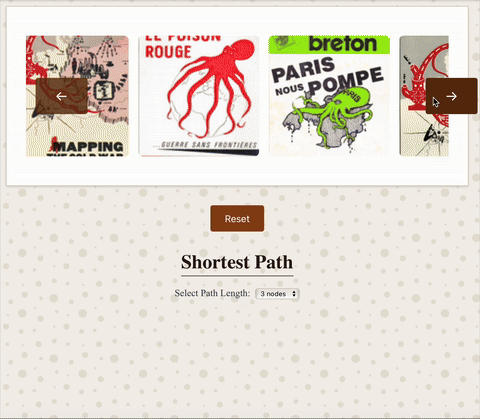
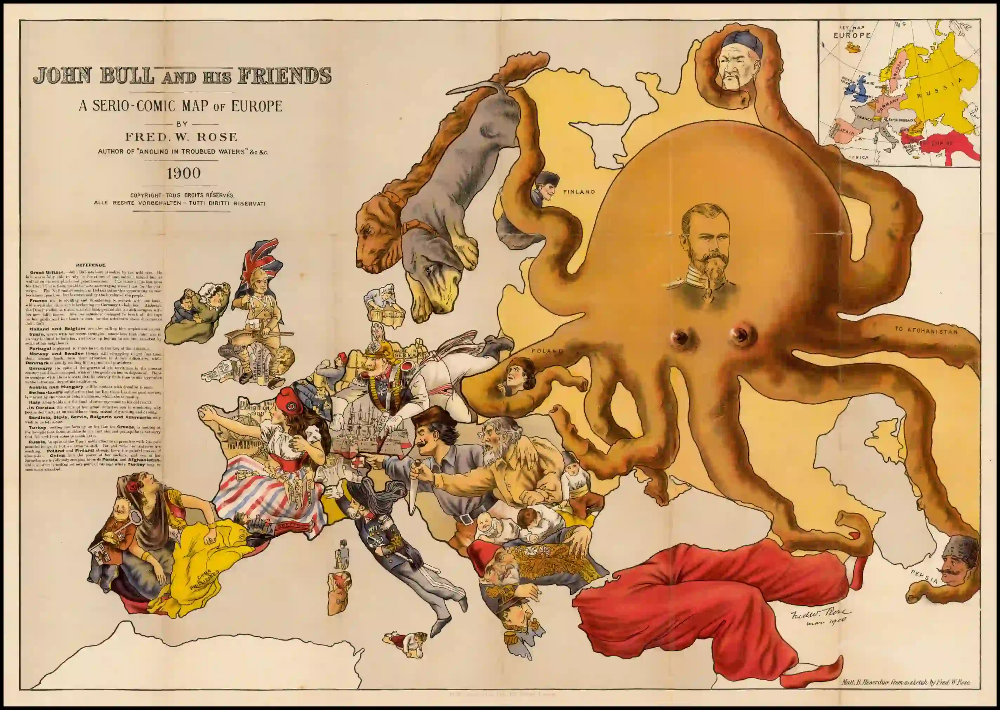
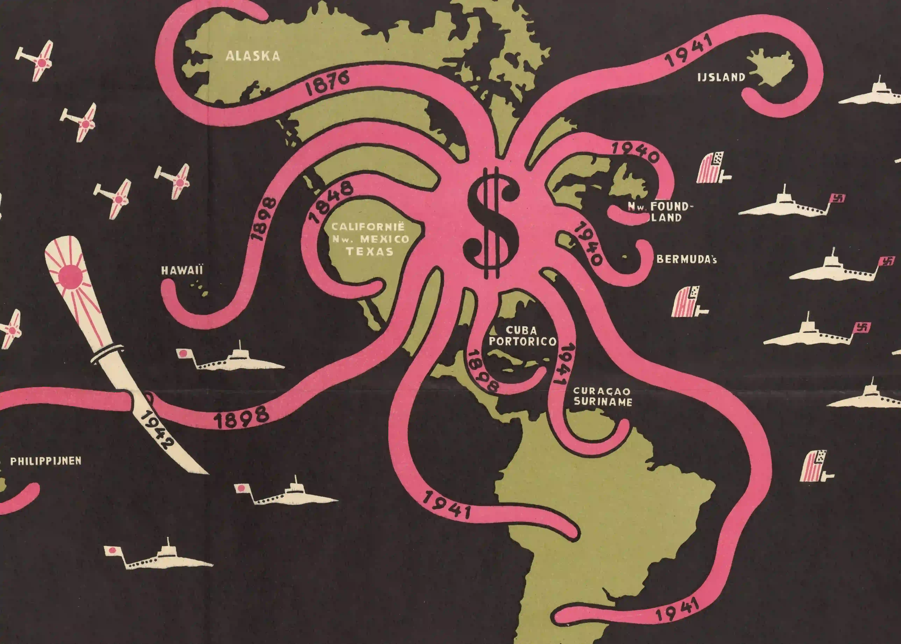
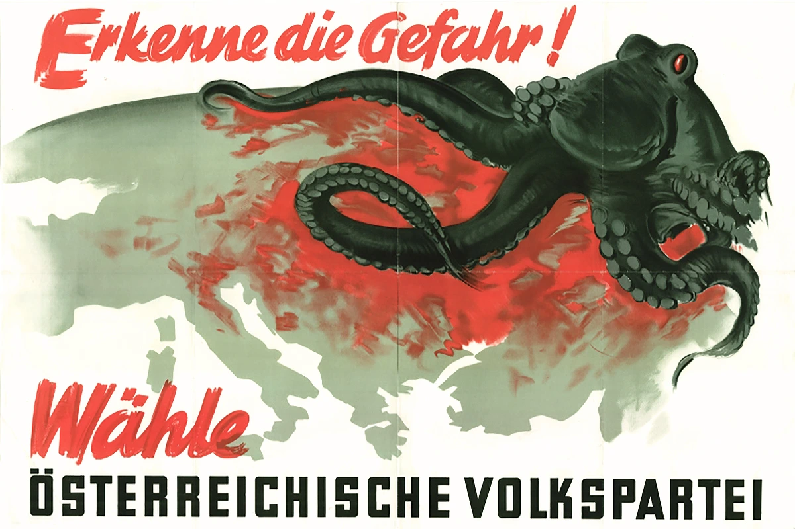
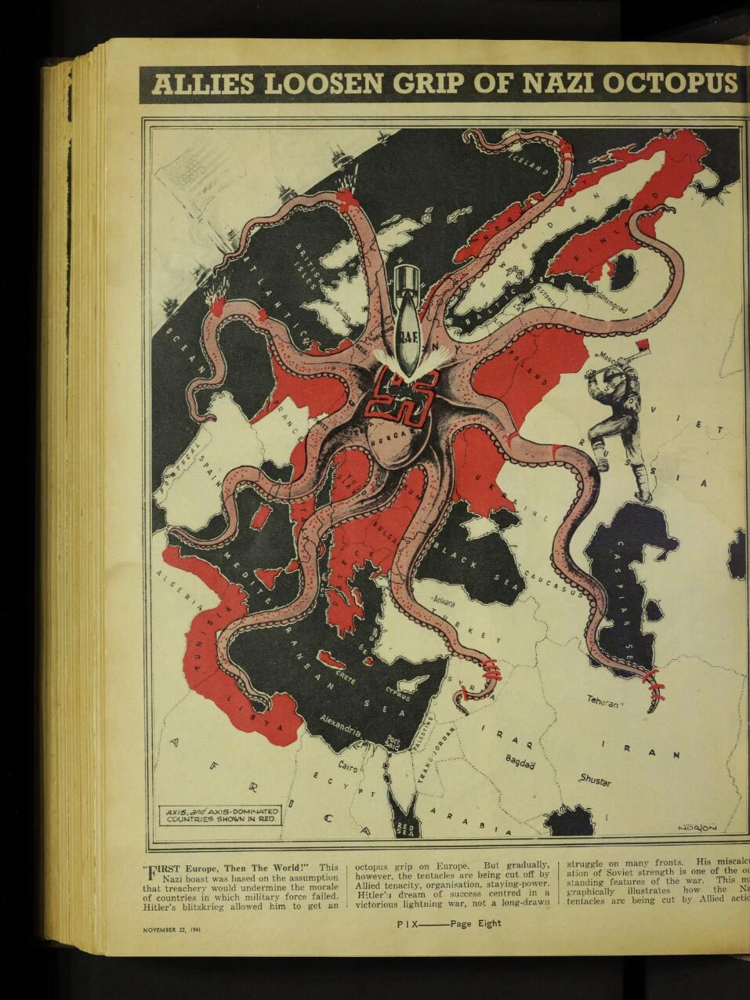
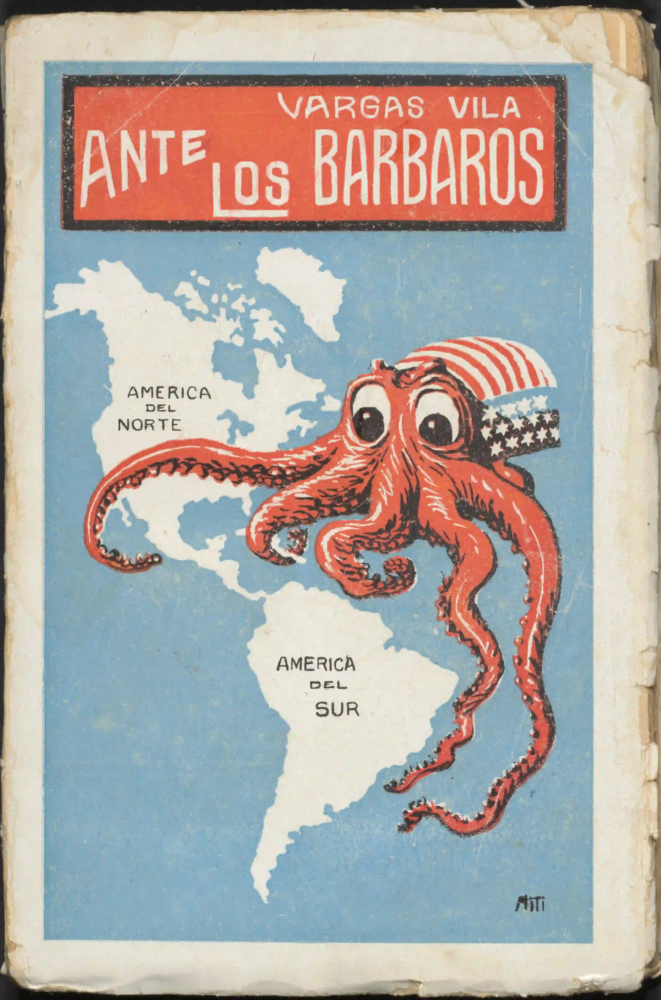
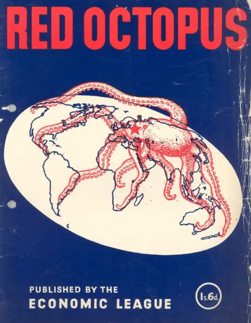

<section class= "flex pt-8 justify-center">
  <h1 class="text-3xl font-bold">Our Research</h1>
</section>

    

     
     <h6 class="absolute text-white bottom-4 left-4 opacity-0 transition duration-300 ease-in-out group-hover:opacity-100 z-40">
       Dataset
     </h6>

      <!-- Because I used the background function instead of images, I used "sr-only" to add the alt texts. -->
     Image: an octopus map made in 1920s with rich cartographic information.
   

    

      
      <h6 class="absolute text-white bottom-4 left-4 opacity-0 transition duration-300 ease-in-out group-hover:opacity-100 z-20">
        Full Article
      </h6>
      Image: a German poster with the octopus and Isranian warrior battling on a globe.
    

    

      
      <h6 class="absolute text-white bottom-4 left-4 opacity-0 transition duration-300 ease-in-out group-hover:opacity-100 z-40">
        Conceptual Metaphors in Octopus Maps
      </h6>
      Image: a cover of a fantasy novel created in the late 19th century, with a giant octopus attacking the ship.
    

    

      
      <h6 class="absolute text-white bottom-4 left-4 opacity-0 transition duration-300 ease-in-out group-hover:opacity-100 z-40">
        Browse the Full Corpus
      </h6>
      Image: A famous octopus map by F.W. Rose in 1870, with the Russian depicted as an giant octopus on the top of the map, and the other European countries are depicted as different people.
    

<section
  class="hero min-h-150"
  style="background-image: url(./assets/img/dollar.webp);"
>
  

  

    

      <h1 class="text-3xl font-bold text-base-100">Octopus Game</h1>
    

    

      <figure class="w-1/2">
        
      </figure>
      

        <h2 class="card-title lg:text-4xl">Visual Similarity of Octopus Maps</h2>
        
There are certain similarity between the octopus maps. Using our corpus, we drew on the current deep learning model and analyze the visual similarity between the octopus maps. Explore with us!

        

          <button class="btn btn-primary">Explore!</button>
        

      

    

  

</section>

<section class="bg-linear-to-b from-gray-400 to-gray-50/0 py-8">
  

    <h1 class="text-3xl font-bold text-base-100">Feature Examples</h1>
  

  

    <article class="card bg-base-100 shadow-sm transition-all ease-in-out hover:-translate-0.5 hover:shadow-2xl">
      <figure href="#">
        
      </figure>
      

        <h2 class="card-title">A Humorous Diplomatic Atlas of Europe and Asia</h2>
        
1904

              

        <button class="btn btn-soft btn-sm">Read More</button>
      

      

    </article>
    <article class="card bg-base-100 shadow-sm transition-all ease-in-out hover:-translate-0.5 hover:shadow-2xl">
      <figure href="#">
        
      </figure>
      

        <h2 class="card-title">John Bull and His Friends</h2>
        
1900

              

        <button class="btn btn-soft btn-sm">Read More</button>
      

      

    </article>
    <article class="card bg-base-100 shadow-sm transition-all ease-in-out hover:-translate-0.5 hover:shadow-2xl">
      <figure href="#">
        
      </figure>
      

        <h2 class="card-title">The Dollar Octopus</h2>
        
1943

              

        <button class="btn btn-soft btn-sm">Read More</button>
      

      

    </article>
    <article class="card bg-base-100 shadow-sm transition-all ease-in-out hover:-translate-0.5 hover:shadow-2xl">
      <figure href="#">
        
      </figure>
      

        <h2 class="card-title">Recognize the danger! Vote for the Austrian People's Party</h2>
        
1949

              

        <button class="btn btn-soft btn-sm">Read More</button>
      

      

    </article>
    <article class="card bg-base-100 shadow-sm transition-all ease-in-out hover:-translate-0.5 hover:shadow-2xl">
      <figure href="#">
        
      </figure>
      

        <h2 class="card-title">Allies Loosen Grip of Nazi Octopus </h2>
        
1941

              

        <button class="btn btn-soft btn-sm">Read More</button>
      

      

    </article>
    <article class="card bg-base-100 shadow-sm transition-all ease-in-out hover:-translate-0.5 hover:shadow-2xl">
      <figure href="#">
        
      </figure>
      

        <h2 class="card-title">Before the Barbarians. The United States and the War</h2>
        
1918

              

        <button class="btn btn-soft btn-sm">Read More</button>
      

      

    </article>
    <article class="card bg-base-100 shadow-sm transition-all ease-in-out hover:-translate-0.5 hover:shadow-2xl">
      <figure href="#">
        
      </figure>
      

        <h2 class="card-title">Revenge</h2>
        
1886

              

        <button class="btn btn-soft btn-sm">Read More</button>
      

      

    </article>
    <article class="card bg-base-100 shadow-sm transition-all ease-in-out hover:-translate-0.5 hover:shadow-2xl">
      <figure href="#">
        
      </figure>
      

        <h2 class="card-title">The Red Octopus</h2>
        
1980

              

        <button class="btn btn-soft btn-sm">Read More</button>
      

      

    </article>
  

  

    <btn class="btn btn-secondary btn-wide">Full Corpus</btn>
  

</section>